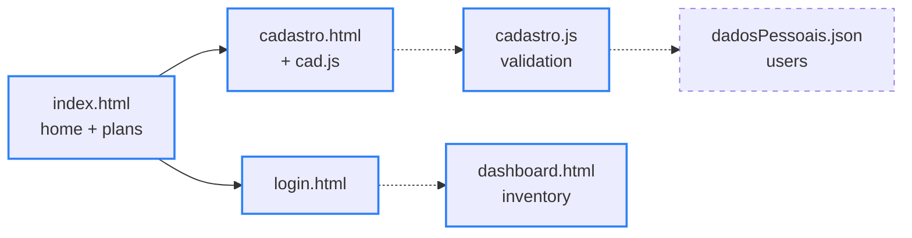

<div align="center">

# 📦 OrganizeMe

> 🌐 Leia em [Português](./README.md)

[](#-how-it-works)

[](#️-technologies-used)

`HTML · CSS · vanilla JavaScript · no build step · license not specified`

</div>

OrganizeMe aims to be a financial management and inventory control platform, with login and sign-up screens plus business rules for product movement. **The project is under development (MVP in progress):** the front-end screens and the sign-up validation already exist; back-end integration and inventory control come next.

---

## 📑 Table of Contents

- [🗂️ Project Structure](#️-project-structure)
- [🗂️ Project Structure - tree](#️-project-structure---tree)
- [👥 Context](#-context)
- [🔄 How it works](#-how-it-works)
- [🗄️ Data model](#️-data-model)
- [📰 Business Rules](#-business-rules)
- [⚙️ Technologies used](#️-technologies-used)
- [🚀 How to run](#-how-to-run)
- [✨ Features](#-features)
- [🤝 Contributing](#-contributing)
- [📄 License](#-license)

---

## 🗂️ Project Structure

| Path | Description |
|---|---|
| `back/bancoDeDados/dadosPessoais.json` | Intended storage for users' sign-up data — currently empty, since no server writes to it yet |
| `back/bancoDeDados/inventario.json` | Sample inventory of 15 backpacks, each with `id`, `quantidade` (quantity) and `preco` (price) (see [Data model](#️-data-model)) |
| `back/codigoFonte/cad.js` | Show/hide password buttons for the "Senha" (password) and "Confirmar Senha" (confirm password) fields on the sign-up screen (loaded by `cadastro.html`) |
| `back/codigoFonte/cadastro.js` | Sign-up validation — e-mail format, password rules and a username without spaces; exports `login()`, not yet called by any page |
| `front/CSS/cadastro.css` | Sign-up screen styles: animated gradient background, inputs with icons and headings in the Kolak font |
| `front/CSS/dashboard.css` | Dashboard styles: fixed gradient top bar, toolbar strip and product area |
| `front/CSS/estilo.css` | Home page styles: animated gradient, buttons with a *pulse* effect, cards that fan out on hover and plan cards with an entrance animation |
| `front/CSS/login.css` | Login screen styles with an animated gradient background |
| `front/CSS/fontes/Golos-Text.ttf` | Golos Text font — the file is in the repo, but no `@font-face` loads it yet |
| `front/fonts/KOLAK.ttf` | Kolak font, used in headings via `@font-face` |
| `front/HTML/cadastro.html` | "Criar conta" (create account) form: full name, e-mail, password and password confirmation |
| `front/HTML/dashboard.html` | Dashboard v0.1-alpha: bar with a profile button, Add/Remove Item buttons, a tag field and a product area (layout only) |
| `front/HTML/index.html` | Home page: product pitch, 3 plans (Free, Intermediate and Advanced) and Help, Register and Login buttons |
| `front/HTML/login.html` | Login screen with e-mail, password and a link to sign-up |
| `.gitignore` | Ignores OS files (`.DS_Store`, `Thumbs.db`), `node_modules/`, `.env` and `.vscode/` |
| `Icone.ico` | Favicon used by all 4 pages |
| `README.en.md` | This documentation in English |
| `README.md` | This documentation in Portuguese |

---

## 🗂️ Project Structure - tree

```
🗂️
├── 📁 back
│  ├── 📁 bancoDeDados
│  │  ├── 📈 dadosPessoais.json
│  │  └── 📈 inventario.json
│  └── 📁 codigoFonte
│     ├── ⚙️ cad.js
│     └── ⚙️ cadastro.js
├── 📁 front
│  ├── 📁 CSS
│  │  ├── 📁 fontes
│  │  │  └── 📄 Golos-Text.ttf
│  │  ├── 🎨 cadastro.css
│  │  ├── 🎨 dashboard.css
│  │  ├── 🎨 estilo.css
│  │  └── 🎨 login.css
│  ├── 📁 fonts
│  │  └── 📄 KOLAK.ttf
│  └── 📁 HTML
│     ├── 🌐 cadastro.html
│     ├── 🌐 dashboard.html
│     ├── 🌐 index.html
│     └── 🌐 login.html
├── 🔧 .gitignore
├── 🖼️ Icone.ico
├── 🇺🇸 README.en.md
└── 🇧🇷 README.md
```

---

## 👥 Context

**Collaborative academic project** developed by 2nd-period Systems Analysis and Development (ADS) students at Centro Universitário Maurício de Nassau (Olinda/PE), for the Coding course led by professor Filipe Araújo. The team has 11 people; the repository is maintained by David Brian.

**Development team**

- [David Brian](https://github.com/briandevbr)
- [Davi Perrelli](https://github.com/DaviPerrelli15)
- [Thiago Guimarães](https://github.com/thiagoguimaraessf-afk)
- [Rayanne Melo](https://github.com/rayannemelo222)
- [Kauã Heinzel](https://github.com/kauaheinzel)
- [Guilherme Cauã](https://github.com/gui-cauadev)
- [Miguel Arthur](https://github.com/miguelarthur202)
- [Carlos Henrique](https://github.com/carloshenrique1611)
- [Eduardo Willian](https://github.com/BigEddie-png)
- [Renato Vinícius](https://github.com/v1ninato)
- [Pedro Madson](https://github.com/PedroMadsonDevBr)

**Tutor:** [Filipe Araújo](https://github.com/FilipeHSAraujo)

---

## 🔄 How it works



<sub>Blue border = already in the code · dashed border = next steps · dotted arrow = not wired up yet</sub>

Navigation between screens already works: from the home page, the Register and Login buttons (and the plan buttons) lead to the sign-up and login screens. What's missing is wiring the pieces together — the sign-up form doesn't call the validation yet, login doesn't lead to the dashboard yet, and nothing is written to JSON.

The most interesting part of the code is the validation in `cadastro.js`: a chain of checks with early returns. Each rule that fails returns `{ erro }` (error) with that rule's message and stops there; only when everything passes does the function return `{ dados }` (data), with the e-mail and username already trimmed. The rules run in this order: valid e-mail → password with 8+ characters → special character (`!@#$%*`) → uppercase letter → no spaces in the password → no spaces in the username.

Real output (Node.js 22) — the error messages are in Portuguese, as in the code:

```text
login("ana@empresa",        "Senha@123", "ana")        → { erro: "email invalido" }
login("ana@empresa.com",    "senha1",    "ana")        → { erro: "a senha precisa ter mais de 8 caracteres" }
login("ana@empresa.com",    "senha123",  "ana")        → { erro: "1 caractere especial ex: !@#$%*" }
login("ana@empresa.com",    "senha@123", "ana")        → { erro: "precisa de 1 letra maiuscula" }
login("ana@empresa.com",    "Senha@123", "ana souza")  → { erro: "usuario nao pode conter espaco" }
login("  ana@empresa.com ", "Senha@123", "  ana  ")    → { dados: { email: "ana@empresa.com", senha: "Senha@123", username: "ana" } }
```

---

## 🗄️ Data model

For now, the "databases" are JSON files in `back/bancoDeDados/`.

**`inventario.json`** — a `produtos` (products) object whose keys are the product names:

| Field | Type in the file | Example | Notes |
|---|---|---|---|
| *(key)* | string | `"Mochila Gamer Para Notebook Até 17 Polegadas Acolchoada"` | Full product name |
| `id` | string | `"8"` | Sequential from `"1"` to `"15"`, no repeats — the basis for RN04 |
| `quantidade` (quantity) | string | `"120"` | 80 to 800 units per product; 4,230 in total |
| `preco` (price) | string | `"289"` | Price in BRL, from R$ 35 to R$ 289 |

- **Coverage:** 15 products, all backpacks.
- **Quirk:** numbers are stored as strings, so they need converting before adding or comparing — as strings, `"80" > "100"` is true.

**`dadosPessoais.json`** — empty file (0 bytes), reserved for registered users.

---

## 📰 Business Rules

- **RN01:** the system must log product entries and exits.
- **RN02:** the system must automatically update the available quantity after a movement.
- **RN03:** the system must alert when a product reaches the minimum stock level.
- **RN04:** each product must have a unique identifier code.
- **RN05:** the system must log who was responsible for each movement.
- **RN06:** products with a quantity of zero must be flagged as "Out of stock".
- **RN07:** access to certain functions must depend on the user's permission level.

The business scope also covers: temporary product reservation during checkout, tracking the reservation's expiration deadline, updating stock after payment confirmation, deducting stock upon order shipment, and automatically releasing reserved products when the reservation expires or payment isn't confirmed.

None of these rules are implemented yet — they are the scope of the inventory dashboard (see [Features](#-features)).

---

## ⚙️ Technologies used

- [HTML5](https://developer.mozilla.org/en-US/docs/Web/HTML) — structure of the 4 pages
- [CSS3](https://developer.mozilla.org/en-US/docs/Web/CSS) — layout, animated gradients with `@keyframes`, a *pulse* effect on buttons and cards with hover transforms
- Vanilla JavaScript — show/hide password, plan entrance animation with [IntersectionObserver](https://developer.mozilla.org/en-US/docs/Web/API/Intersection_Observer_API) and sign-up validation (ES module)
- [Font Awesome](https://fontawesome.com/) — icons on the sign-up screen and the dashboard
- [Inter](https://fonts.google.com/specimen/Inter) (Google Fonts) — home page text; the local Kolak font is used for headings
- Git + GitHub — version control and the team's Pull Request flow
- [Node.js](https://nodejs.org/) (planned — back-end server and saving data to JSON)

---

## 🚀 How to run

Prerequisite: [VS Code](https://code.visualstudio.com/) with the [Live Server](https://marketplace.visualstudio.com/items?itemName=ritwickdey.LiveServer) extension. The back-end doesn't have a configured server yet, so for now you can only preview the front-end:

```bash
git clone https://github.com/briandevbr/OrganizeMe.git
cd OrganizeMe
code .
```

In VS Code, right-click `front/HTML/index.html` and choose **"Open with Live Server"**. The home page opens with the 3 plans; the Register and Login buttons lead to the sign-up and login screens. The dashboard isn't linked from the other screens yet — open `front/HTML/dashboard.html` directly with Live Server. Icons and the Inter font come from a CDN, so you need an internet connection.

To try the sign-up validation in the terminal (optional, requires [Node.js](https://nodejs.org/) 22.7+):

```bash
node --input-type=module -e 'import { login } from "./back/codigoFonte/cadastro.js"; console.log(login("ana@empresa.com", "senha123", "ana"))'
# { erro: '1 caractere especial ex: !@#$%*' }
```

---

## ✨ Features

**Progress: 6 of 14 steps done**

- [x] Home page with the product pitch, Help/Register/Login buttons and 3 plans (Free, Intermediate at R$ 19.99/month and Advanced at R$ 29.99/month) with an entrance animation
- [x] Sign-up screen with show/hide password on the "Senha" and "Confirmar Senha" fields
- [x] Login screen with e-mail, password and a link to sign-up
- [x] Sign-up validation in JS: e-mail format, password with 8+ characters, a special character, an uppercase letter and no spaces, username without spaces
- [x] Dashboard layout (v0.1-alpha): bar with a profile button, Add/Remove Item buttons, a tag field and a product area
- [x] Sample inventory of 15 products in JSON
- [ ] Wire `cadastro.js` into the sign-up form
- [ ] Show/hide password on the login screen
- [ ] Authentication: login leading to the dashboard, with a profile shortcut and redirects depending on whether the user is logged in
- [ ] Node.js server saving users to `dadosPessoais.json`
- [ ] Working dashboard: add and remove inventory items, logging entries/exits and who made them (RN01, RN02, RN04, RN05)
- [ ] Minimum-stock alert and "Out of stock" flag (RN03, RN06)
- [ ] Access control by permission level (RN07)
- [ ] Help Center: FAQ accordion and support channels (e-mail, chat, WhatsApp)

---

## 🤝 Contributing

This is a group academic project. Team contributions follow the standard Pull Request flow: create a branch, make your changes, and open a PR for review before merging into `main`. Suggestions from outside the team are welcome via [issues](https://github.com/briandevbr/OrganizeMe/issues).

---

## 📄 License

License not specified.

---

<div align="center">
  <sub>Made by <a href="https://github.com/briandevbr">David Brian</a> and team · 2nd-period ADS academic project</sub>
</div>
