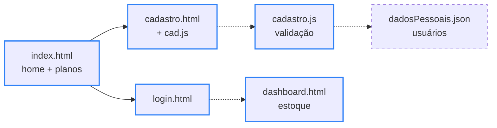

<div align="center">

# 📦 OrganizeMe

> 🌐 Read this in [English](./README.en.md)

[](#-como-funciona)

[](#️-tecnologias-usadas)

`HTML · CSS · JavaScript puro · sem build · licença não especificada`

</div>

O OrganizeMe se propõe a ser uma plataforma de gestão financeira e controle de estoque, com telas de login, cadastro e regras de negócio para movimentação de produtos. **Projeto em desenvolvimento (MVP em construção):** as telas do front e a validação de cadastro já existem; a integração com o back-end e o controle de estoque vêm a seguir.

---

## 📑 Sumário

- [🗂️ Estrutura do Projeto](#️-estrutura-do-projeto)
- [🗂️ Estrutura do Projeto - tree](#️-estrutura-do-projeto---tree)
- [👥 Contexto](#-contexto)
- [🔄 Como funciona](#-como-funciona)
- [🗄️ Modelo de dados](#️-modelo-de-dados)
- [📰 Regras de Negócio](#-regras-de-negócio)
- [⚙️ Tecnologias usadas](#️-tecnologias-usadas)
- [🚀 Como rodar](#-como-rodar)
- [✨ Funcionalidades](#-funcionalidades)
- [🤝 Contribuindo](#-contribuindo)
- [📄 Licença](#-licença)

---

## 🗂️ Estrutura do Projeto

| Caminho | Descrição |
|---|---|
| `back/bancoDeDados/dadosPessoais.json` | Destino previsto para os dados de cadastro dos usuários — hoje vazio, pois ainda não há servidor gravando nele |
| `back/bancoDeDados/inventario.json` | Inventário de exemplo com 15 mochilas, cada uma com `id`, `quantidade` e `preco` (ver [Modelo de dados](#️-modelo-de-dados)) |
| `back/codigoFonte/cad.js` | Botões de mostrar/ocultar senha dos campos "Senha" e "Confirmar Senha" da tela de cadastro (carregado por `cadastro.html`) |
| `back/codigoFonte/cadastro.js` | Validação do cadastro — formato do e-mail, regras de senha e nome de usuário sem espaço; exporta `login()`, ainda não chamado por nenhuma página |
| `front/CSS/cadastro.css` | Estilos da tela de cadastro: fundo em gradiente animado, inputs com ícone e títulos na fonte Kolak |
| `front/CSS/dashboard.css` | Estilos do dashboard: barra superior fixa em gradiente, faixa de ferramentas e área de produtos |
| `front/CSS/estilo.css` | Estilos da página inicial: gradiente animado, botões com efeito *pulse*, cards que se abrem no hover e cards de planos com animação de entrada |
| `front/CSS/login.css` | Estilos da tela de login com fundo em gradiente animado |
| `front/CSS/fontes/Golos-Text.ttf` | Fonte Golos Text — o arquivo está no repo, mas ainda não há `@font-face` carregando ele |
| `front/fonts/KOLAK.ttf` | Fonte Kolak, usada nos títulos via `@font-face` |
| `front/HTML/cadastro.html` | Formulário "Criar conta": nome completo, e-mail, senha e confirmação de senha |
| `front/HTML/dashboard.html` | Dashboard v0.1-alpha: barra com botão de perfil, botões Add/Remove Item, campo de tags e área de produtos (só layout) |
| `front/HTML/index.html` | Página inicial: chamada do produto, 3 planos (Free, Intermediário e Avançado) e botões Ajuda, Registrar e Login |
| `front/HTML/login.html` | Tela de login com e-mail, senha e link para o cadastro |
| `.gitignore` | Ignora arquivos de sistema (`.DS_Store`, `Thumbs.db`), `node_modules/`, `.env` e `.vscode/` |
| `Icone.ico` | Favicon usado pelas 4 páginas |
| `README.en.md` | Esta documentação em inglês |
| `README.md` | Esta documentação em português |

---

## 🗂️ Estrutura do Projeto - tree

```
🗂️
├── 📁 back
│  ├── 📁 bancoDeDados
│  │  ├── 📈 dadosPessoais.json
│  │  └── 📈 inventario.json
│  └── 📁 codigoFonte
│     ├── ⚙️ cad.js
│     └── ⚙️ cadastro.js
├── 📁 front
│  ├── 📁 CSS
│  │  ├── 📁 fontes
│  │  │  └── 📄 Golos-Text.ttf
│  │  ├── 🎨 cadastro.css
│  │  ├── 🎨 dashboard.css
│  │  ├── 🎨 estilo.css
│  │  └── 🎨 login.css
│  ├── 📁 fonts
│  │  └── 📄 KOLAK.ttf
│  └── 📁 HTML
│     ├── 🌐 cadastro.html
│     ├── 🌐 dashboard.html
│     ├── 🌐 index.html
│     └── 🌐 login.html
├── 🔧 .gitignore
├── 🖼️ Icone.ico
├── 🇺🇸 README.en.md
└── 🇧🇷 README.md
```

---

## 👥 Contexto

**Projeto acadêmico colaborativo** desenvolvido por alunos do 2º período de Análise e Desenvolvimento de Sistemas (ADS) do Centro Universitário Maurício de Nassau (Olinda/PE), na disciplina de Coding do professor Filipe Araújo. São 11 pessoas na equipe; o repositório é mantido por David Brian.

**Equipe de desenvolvimento**

- [David Brian](https://github.com/briandevbr)
- [Davi Perrelli](https://github.com/DaviPerrelli15)
- [Thiago Guimarães](https://github.com/thiagoguimaraessf-afk)
- [Rayanne Melo](https://github.com/rayannemelo222)
- [Kauã Heinzel](https://github.com/kauaheinzel)
- [Guilherme Cauã](https://github.com/gui-cauadev)
- [Miguel Arthur](https://github.com/miguelarthur202)
- [Carlos Henrique](https://github.com/carloshenrique1611)
- [Eduardo Willian](https://github.com/BigEddie-png)
- [Renato Vinícius](https://github.com/v1ninato)
- [Pedro Madson](https://github.com/PedroMadsonDevBr)

**Tutor:** [Filipe Araújo](https://github.com/FilipeHSAraujo)

---

## 🔄 Como funciona



<sub>Borda azul = já existe no código · borda tracejada = próximas etapas · seta pontilhada = ligação ainda não feita</sub>

A navegação entre as telas já funciona: da página inicial, os botões Registrar e Login (e os botões dos planos) levam ao cadastro e ao login. O que falta é ligar as peças — o formulário de cadastro ainda não chama a validação, o login ainda não leva ao dashboard e nada é gravado em JSON.

A parte mais interessante do código é a validação em `cadastro.js`: uma cadeia de checagens com retorno antecipado. Cada regra que falha devolve `{ erro }` com a mensagem daquela regra e para ali; só quando tudo passa a função devolve `{ dados }`, com e-mail e usuário já sem espaços nas pontas. As regras rodam nesta ordem: e-mail válido → senha com 8+ caracteres → caractere especial (`!@#$%*`) → letra maiúscula → senha sem espaço → usuário sem espaço.

Saída real (Node.js 22):

```text
login("ana@empresa",        "Senha@123", "ana")        → { erro: "email invalido" }
login("ana@empresa.com",    "senha1",    "ana")        → { erro: "a senha precisa ter mais de 8 caracteres" }
login("ana@empresa.com",    "senha123",  "ana")        → { erro: "1 caractere especial ex: !@#$%*" }
login("ana@empresa.com",    "senha@123", "ana")        → { erro: "precisa de 1 letra maiuscula" }
login("ana@empresa.com",    "Senha@123", "ana souza")  → { erro: "usuario nao pode conter espaco" }
login("  ana@empresa.com ", "Senha@123", "  ana  ")    → { dados: { email: "ana@empresa.com", senha: "Senha@123", username: "ana" } }
```

---

## 🗄️ Modelo de dados

Por enquanto os "bancos" são arquivos JSON em `back/bancoDeDados/`.

**`inventario.json`** — objeto `produtos`, em que a chave é o nome do produto:

| Campo | Tipo no arquivo | Exemplo | Observação |
|---|---|---|---|
| *(chave)* | texto | `"Mochila Gamer Para Notebook Até 17 Polegadas Acolchoada"` | Nome completo do produto |
| `id` | texto | `"8"` | Sequencial de `"1"` a `"15"`, sem repetição — base para a RN04 |
| `quantidade` | texto | `"120"` | De 80 a 800 unidades por produto; 4.230 no total |
| `preco` | texto | `"289"` | Preço em reais, de R$ 35 a R$ 289 |

- **Cobertura:** 15 produtos, todos mochilas.
- **Peculiaridade:** os números estão gravados como texto, então precisam de conversão antes de somar ou comparar — como texto, `"80" > "100"` dá verdadeiro.

**`dadosPessoais.json`** — arquivo vazio (0 bytes), reservado para os usuários cadastrados.

---

## 📰 Regras de Negócio

- **RN01:** o sistema deve registrar a entrada e saída de produtos.
- **RN02:** o sistema deve atualizar automaticamente a quantidade disponível após uma movimentação.
- **RN03:** o sistema deve alertar quando um produto atingir o estoque mínimo.
- **RN04:** cada produto deve possuir um código identificador único.
- **RN05:** o sistema deve registrar o responsável por cada movimentação.
- **RN06:** produtos com quantidade igual a zero devem ser identificados como "Sem estoque".
- **RN07:** o acesso a determinadas funções deve depender do nível de permissão do usuário.

Além disso, o escopo de negócio prevê: reserva temporária de produtos durante o checkout, registro do prazo de expiração da reserva, atualização do estoque após confirmação de pagamento, baixa do estoque na expedição do pedido, e liberação automática de produtos reservados quando a reserva expira ou o pagamento não é confirmado.

As regras ainda não estão implementadas — elas são o escopo do dashboard de estoque (ver [Funcionalidades](#-funcionalidades)).

---

## ⚙️ Tecnologias usadas

- [HTML5](https://developer.mozilla.org/pt-BR/docs/Web/HTML) — estrutura das 4 páginas
- [CSS3](https://developer.mozilla.org/pt-BR/docs/Web/CSS) — layout, gradientes animados com `@keyframes`, efeito *pulse* nos botões e cards com transformações no hover
- JavaScript puro — mostrar/ocultar senha, animação de entrada dos planos com [IntersectionObserver](https://developer.mozilla.org/pt-BR/docs/Web/API/Intersection_Observer_API) e validação do cadastro (módulo ES)
- [Font Awesome](https://fontawesome.com/) — ícones do cadastro e do dashboard
- [Inter](https://fonts.google.com/specimen/Inter) (Google Fonts) — texto da página inicial; a fonte Kolak, local, fica nos títulos
- Git + GitHub — versionamento e fluxo de Pull Request da equipe
- [Node.js](https://nodejs.org/) (planejado — servidor do back-end e gravação dos dados em JSON)

---

## 🚀 Como rodar

Pré-requisito: [VS Code](https://code.visualstudio.com/) com a extensão [Live Server](https://marketplace.visualstudio.com/items?itemName=ritwickdey.LiveServer). O back-end ainda não tem servidor configurado, então por enquanto só dá para visualizar o front:

```bash
git clone https://github.com/briandevbr/OrganizeMe.git
cd OrganizeMe
code .
```

No VS Code, clique com o botão direito em `front/HTML/index.html` e escolha **"Open with Live Server"**. Abre a página inicial com os 3 planos; os botões Registrar e Login levam às telas de cadastro e login. O dashboard ainda não tem link a partir das outras telas — abra `front/HTML/dashboard.html` direto pelo Live Server. Os ícones e a fonte Inter vêm de CDN, então é preciso estar conectado à internet.

Para testar a validação do cadastro no terminal (opcional, precisa de [Node.js](https://nodejs.org/) 22.7+):

```bash
node --input-type=module -e 'import { login } from "./back/codigoFonte/cadastro.js"; console.log(login("ana@empresa.com", "senha123", "ana"))'
# { erro: '1 caractere especial ex: !@#$%*' }
```

---

## ✨ Funcionalidades

**Progresso: 6 de 14 etapas concluídas**

- [x] Página inicial com chamada do produto, botões Ajuda/Registrar/Login e 3 planos (Free, Intermediário R$ 19,99/mês e Avançado R$ 29,99/mês) com animação de entrada
- [x] Tela de cadastro com mostrar/ocultar senha nos campos "Senha" e "Confirmar Senha"
- [x] Tela de login com e-mail, senha e link para o cadastro
- [x] Validação do cadastro em JS: formato de e-mail, senha com 8+ caracteres, caractere especial, letra maiúscula e sem espaços, nome de usuário sem espaço
- [x] Layout do dashboard (v0.1-alpha): barra com perfil, botões Add/Remove Item, campo de tags e área de produtos
- [x] Inventário de exemplo com 15 produtos em JSON
- [ ] Ligar `cadastro.js` ao formulário de cadastro
- [ ] Mostrar/ocultar senha na tela de login
- [ ] Autenticação: login levando ao dashboard, com atalho de perfil e redirecionamento conforme o usuário estar logado
- [ ] Servidor Node.js gravando os usuários em `dadosPessoais.json`
- [ ] Dashboard funcional: adicionar e remover itens do inventário, registrando entrada/saída e responsável (RN01, RN02, RN04, RN05)
- [ ] Alerta de estoque mínimo e marcação "Sem estoque" (RN03, RN06)
- [ ] Controle de acesso por nível de permissão (RN07)
- [ ] Central de Ajuda: FAQ em accordion e canais de suporte (e-mail, chat, WhatsApp)

---

## 🤝 Contribuindo

Este é um projeto acadêmico em grupo. Contribuições da equipe seguem o fluxo padrão de Pull Request: crie uma branch, faça as alterações e abra um PR para revisão antes do merge em `main`. Sugestões de fora da equipe são bem-vindas via [issues](https://github.com/briandevbr/OrganizeMe/issues).

---

## 📄 Licença

Licença não especificada.

---

<div align="center">
  <sub>Feito por <a href="https://github.com/briandevbr">David Brian</a> e equipe · projeto acadêmico do 2º período de ADS</sub>
</div>
